## CSC4005 Distributed and Parallel Computing

## Project 2:  Parallel Matrix Multiplication 

# Report

#### Yuhang, Wang

#### 120090246

## How to run my code

#### Programming Environment

<table>
  <tr>
    <th>Item</th>
    <th>Configuration / Version</th>
  </tr>
  <tr>
    <td align="center">System Type</td>
    <td>x86_64</td>
  </tr>
  <tr>
    <td align="center">Opearing System</td>
    <td>CentOS Linux release 7.5.1804</td>
  </tr>
  <tr>
    <td align="center">CPU</td>
    <td>
      Intel(R) Xeon(R) Silver 4210R CPU @ 2.40GHz
      <br/>
      20 Cores, 40 Threads
    </td>
  </tr>
  <tr>
    <td align="center">Memory</td>
    <td>100GB RAM</td>
  </tr>
  <tr>
    <td align="center">GPU</td>
    <td>one Nvidia Quadro RTX 4000 GPU card for each node</td>
  </tr>
  <tr>
    <td align="center">CUDA</td>
    <td>11.7</td>
  </tr>
  <tr>
    <td align="center">GCC</td>
    <td>Red Hat 7.3.1-5</td>
  </tr>
  <tr>
    <td align="center">CMake</td>
    <td>3.14.1</td>
  </tr>
</table>
#### Instruction for running my code

- Firstly, **`cd` into** the **`project2`** root folder. 
- Secondly, edit the file `src/sbatch.sh` , and change whatever you need, especially the **filepaths** of the matrixs.
- Finally, run the following code, and you can also use `comparison.py` to verify that the results of each parallel methods gives the same answer.

```apl
mkdir build && cd build
cmake ..
make -j32
cd ..
sbatch ./src/scripts/sbatch.sh

# if you want to compare whether the result is correct, using the following python script
python comparison.py

# if you want to generate a random matrix for your personal use:
python generate_matrix.py
```


## Matrix Multiplication using CPU and GPU

#### Combination of multiple parallel methods

##### Focusing on memory locality

- The i, j, k loop order really matters, the best order offers a least cache miss.
- Use pointer for better memory access efficiency.
- Extract and pre-calculate those variables that would be frequently visited.

##### Using SIMD, OpenMP, and MPI together

- Since OpenMP is Thread-Level Parallelism (TLP), SIMD is Data-Level Parallelism (DLP), and since MPI divides the program execution into MASTER process and SLAVE processes then combines them together. They can be combined together to achieve a higher performance which takes far less running time.

##### GPU acceleration

- When using CUDA, it is of vital importance to set the hyperparameter to get faster, bad block size and block dimension often leads to bad performance.

#### MY Execution Time

Performance measured as execution time in **milliseconds**.

##### 1024*1024 Matrix Multiplication

| Number of Processes / Cores | Naive | Memory Locality | SIMD + Memory Locality | OpenMP + SIMD + Memory Locality | MPI + OpenMP + SIMD + Memory Locality | CUDA (GPU)  |
| --------------------------- | ----- | --------------- | ---------------------- | ------------------------------- | ------------------------------------- | ----------- |
| 1                           | 8174  | 764             | 270                    | 271                             | 45                                    | **22.3424** |
| 2                           | N/A   | N/A             | N/A                    | 227                             | 46                                    | N/A         |
| 4                           | N/A   | N/A             | N/A                    | 118                             | 45                                    | N/A         |
| 8                           | N/A   | N/A             | N/A                    | 111                             | 34                                    | N/A         |
| 16                          | N/A   | N/A             | N/A                    | 66                              | **31**                                | N/A         |
| 32                          | N/A   | N/A             | N/A                    | **41**                          | 58                                    | N/A         |

##### 2048*2048 Matrix Multiplication

| Number of Processes / Cores | Naive | Memory Locality | SIMD + Memory Locality | OpenMP + SIMD + Memory Locality | MPI + OpenMP + SIMD + Memory Locality | CUDA (GPU)  |
| --------------------------- | ----- | --------------- | ---------------------- | ------------------------------- | ------------------------------------- | ----------- |
| 1                           | 88887 | 6382            | 2690                   | 2673                            | 238                                   | **160.274** |
| 2                           | N/A   | N/A             | N/A                    | 1902                            | **171**                               | N/A         |
| 4                           | N/A   | N/A             | N/A                    | 1008                            | 203                                   | N/A         |
| 8                           | N/A   | N/A             | N/A                    | 555                             | 236                                   | N/A         |
| 16                          | N/A   | N/A             | N/A                    | 364                             | 292                                   | N/A         |
| 32                          | N/A   | N/A             | N/A                    | **209**                         | 462                                   | N/A         |


## Profiling Records using perf

#### Naive

##### CPU cycles

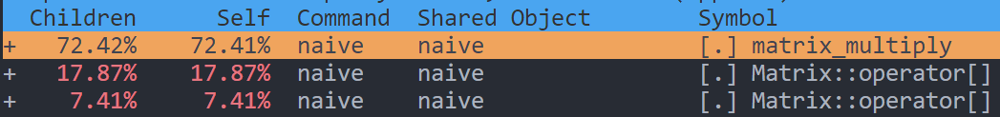

##### cache misses

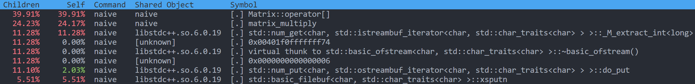

##### page faults

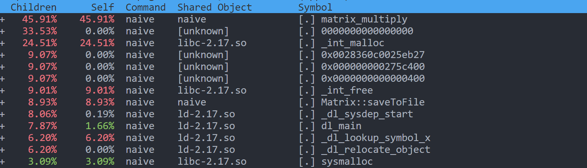


#### Memory Locality

##### CPU cycles

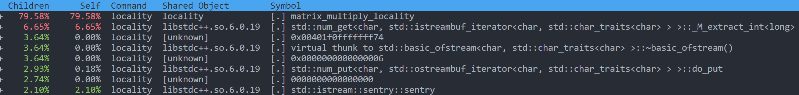

##### cache misses

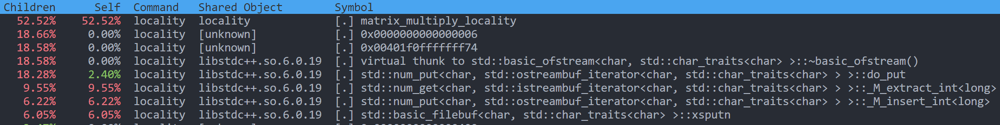

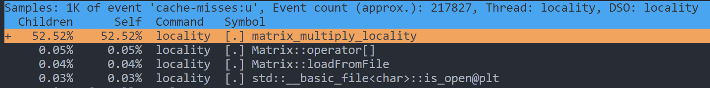

By arranging the order of the loop and using pointer for better access to the data, the cache misses of **`Matrix::operator[]`** is significantly decreasing, from **39.91%** to **0.05%**, which means we access data more efficiently.

##### page faults

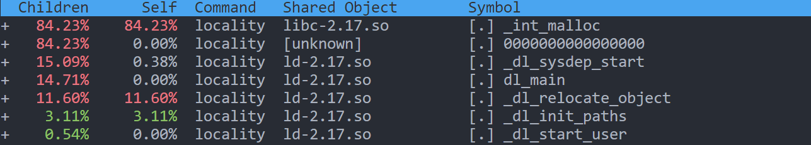


#### SIMD + Memory Locality

##### CPU cycles

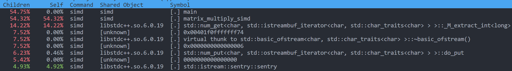

##### cache misses

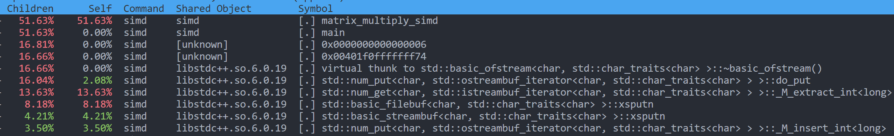

##### page faults

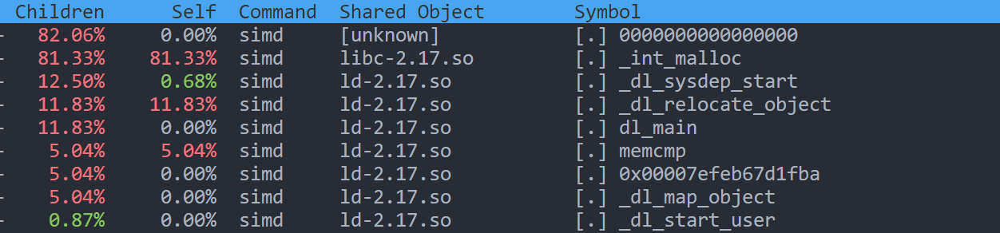

It is obvious that by using `SIMD`, we significantly decrease the CPU cycles, because that the proportion of multiplication decreases from **`79.58%`** to **` 54.32%`** , while the total CPU cycles is decreasing.

#### OpenMP + SIMD + Memory Locality

##### CPU cycles

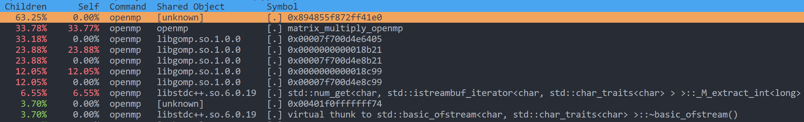

##### cache misses

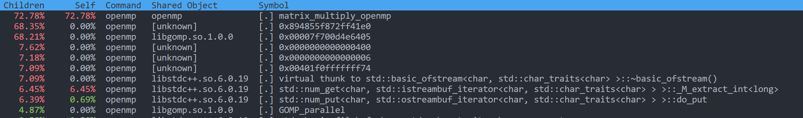

##### page faults

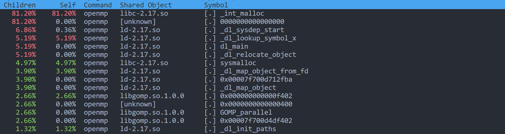


#### MPI + OpenMP + SIMD + Memory Locality

##### CPU cycles

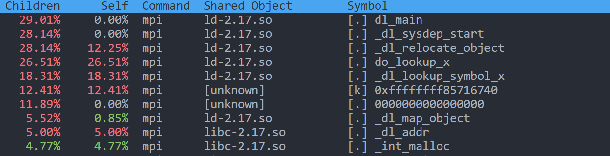

##### cache misses

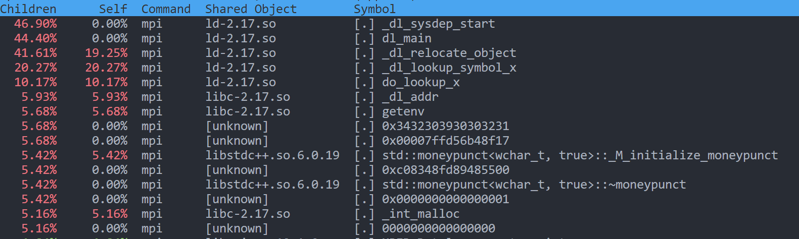

##### page faults

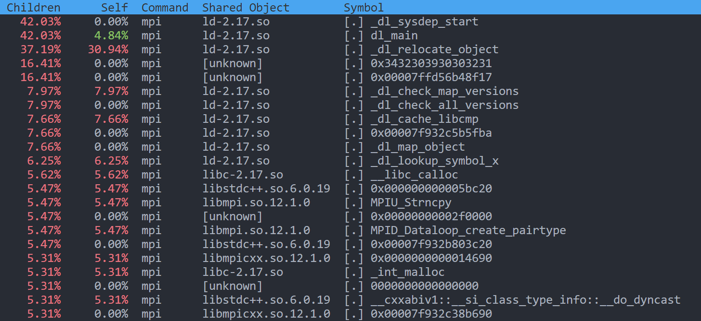